# AI Avatar for Academic Advising using a Fine-Tuned Large Language Model

Generated: 2026-06-23T03:05:35

## Abstract

Academic advising for programme-heavy faculties depends on accurate answers to course structures, prerequisites, assessment rules, and progression requirements. Students often ask the same questions through informal channels, and staff must repeat details that already exist in official programme documents. This project develops Hive, an AI academic advising kiosk for Multimedia University Faculty of Artificial Intelligence and Engineering. The system combines a fine-tuned language model, retrieval-augmented generation, deterministic course guards, and an Ebee avatar interface.
The implementation uses a React and Vite frontend, FastAPI backend modules, FAISS indexes, structured JSONL knowledge files, and a Qwen/Unsloth fine-tuned runtime in WSL. The frontend displays a kiosk chat experience and avatar states. The backend routes questions through exact QA matching, course-structure guards, hybrid retrieval, reranking, and fallback generation. The knowledge base includes Intelligent Robotics and Applied AI programme structures, prerequisite rules, course catalogues, source facts, and generated QA pairs.
Evaluation used stored QA pairs, product-path RAG checks, raw-backend checks, and rendered UI tests. Current evidence records 1315/1315 passing rows in the full QA-pair audit, 20/20 passing rows for the product path, 20/20 passing rows for the raw backend path, and 500/500 passing rows for the beginner question set. A separate UI mixed test recorded 300/300 passing questions with an average response time of 532 ms. The results show that guarded RAG fits academic advising because the system can prefer official source facts over fluent but unsupported generation.

## Chapter 1: Introduction

Hive addresses the gap between official academic information and the way students ask for help. A student may ask a short question such as whether Project II requires Project I, while the official answer lives across programme structures, subject master documents, prerequisite graphs, and faculty rules. The project turns those sources into a system that answers through a kiosk interface.

The project does not attempt to replace an academic advisor. It provides first-line guidance for factual questions and prepares students before they contact the faculty. The system should still direct students to official channels when a case involves appeals, approvals, graduation checks, transfer credit, or personal academic records.

The core problem is factual reliability. A generic language model can produce confident answers without checking the programme structure. That risk becomes serious when the question involves prerequisites, course codes, or progression rules. Hive therefore uses deterministic guards for high-risk academic facts and retrieval for broader course questions.

The second problem is accessibility. Students who see a plain technical chatbot may treat it as a search box. The kiosk UI and Ebee avatar make the interaction closer to an advising station, while the backend still controls factual grounding.

## Chapter 2: Theoretical Background and Literature Review

Academic advising systems must support repetitive factual questions and decision support. A student may need to know which courses appear in Year 2, how many credit hours Project I requires, or whether a BYOC elective fits a trimester. These questions reward source accuracy more than creative text generation.

Retrieval-augmented generation combines a language model with an external memory. Lewis et al. describe RAG models that pair parametric model memory with a non-parametric index for knowledge-intensive tasks [1]. Hive applies the same principle at project scale: programme structures and QA files sit outside the model, and the backend retrieves them when students ask questions.

Fine-tuning adapts a model to domain language and answer style. LoRA reduces the cost of adaptation by adding trainable low-rank matrices while freezing the base weights [2]. The project uses a fine-tuned Qwen/Unsloth runtime for conversational generation, while course guards protect official facts.

Vector search supports fast lookup over dense document representations. FAISS provides algorithms for similarity search and clustering across large vector sets [3]. Hive uses FAISS indexes with metadata files to retrieve course and programme facts.

Academic advising also needs evaluation. The project uses answer overlap, source checks, endpoint checks, and UI-level tests. Backend correctness alone does not prove that the rendered kiosk shows the right answer.

Karpathy's autoresearch project influenced the project workflow rather than the product dependency graph. The relevant practice is bounded experimentation: run an experiment, log the metric, keep improvements, and discard changes that do not improve the metric [8]. Hive uses that discipline in its RAG and UI evaluation gates.

## Chapter 3: Details of the Design

The system follows a three-part design. The React frontend manages the student-facing kiosk, chat layout, avatar states, and local product guards. The FastAPI backend exposes health and chat endpoints. The WSL runtime serves the fine-tuned model and course-answering path.

The knowledge base uses structured files because official academic data has stable fields. Programme rows, prerequisite rules, subject aliases, course facts, and QA pairs remain inspectable as JSONL or JSON. This choice also makes failed answers easier to debug because each answer can point back to a row or source file.

The answer router gives priority to exact QA matches and deterministic course guards. This order prevents broad course-code matching from stealing a question that belongs to a specific source row. Hybrid retrieval and reranking handle broader questions, while fallback generation covers lower-risk conversational turns.

The frontend uses the AvatarExact component and generated PNG/video states. The older rigged avatar pipeline remains in a standalone showcase. This split keeps the main kiosk simple and stable while preserving the advanced animation work for future development.

The project stores required evaluation scripts inside the frontend workspace. Product checks call the Vite path, raw checks call the backend path, and full QA checks send stored questions through the live service. This makes accuracy a repeatable gate instead of a manual observation.

## Chapter 4: Presentation of Data

The current report pack found 452 report-relevant files after excluding build and cache folders. The workspace includes frontend source, backend source, structured knowledge files, FAISS indexes, evaluation scripts, generated result reports, avatar assets, and handoff documents.

The product RAG evaluation passed 20/20 cases against http://127.0.0.1:5174. The raw backend evaluation passed 20/20 cases against http://127.0.0.1:8021. The full QA-pair live audit passed 1315/1315 rows with average overlap 1. The beginner set passed 500/500 rows.

The live accuracy summary records a larger API and UI regression suite. The patched backend passed 1000/1000 rows from the master accuracy set, 500/500 beginner rows, 1500/1500 mixed regression rows, and 300/300 rendered UI questions. The UI mixed test reported 532 ms average response time, 538 ms P50, 791 ms P95, and 1155 ms maximum response time.

The Git context needs care. The Git root resolves to C:\Users\jeysa, while the FYP folder is untracked inside that wider repository. The report therefore treats this pack as a source snapshot. The parent remote is https://github.com/Jetsaw/Kommu_Ai_ChatBot.git.

## Chapter 5: Discussions on Findings

Exact QA matching produced the clearest improvement. Earlier generated questions reused similar wording across different source facts. The backend could return a high-confidence answer from the wrong row. Source-specific generated questions and exact-normalized matching removed that ambiguity.

The results support a guarded RAG design. The fine-tuned model can help with natural phrasing, but the system should not ask it to remember official academic rules. Course structures, prerequisite graphs, and source facts give the backend a stronger basis for answers.

UI-level testing exposed issues that backend tests missed. The visible message can differ from raw backend output because the frontend may shorten answers or apply local guards. The 300-question rendered UI run therefore gave stronger evidence for student-facing correctness than API tests alone.

The project still has limits. The dataset covers selected programme sources and generated QA rows. The system cannot decide appeals, approve course substitutions, or access personal academic records. The report should position Hive as a factual advising assistant, not an official decision maker.

The writing process uses stop-slop as an editing guide. The skill removes generic AI phrasing, but it does not replace citation, evidence, or academic integrity checks. The report pack avoids Turnitin bypass tooling and keeps source evidence available for supervisor review.

## Chapter 6: Conclusions and Recommendations

Hive shows that an academic advising kiosk can answer programme-specific questions when the system pairs a language model with deterministic source controls. The current evidence shows perfect scores on the stored QA-pair audit, product RAG checks, raw backend checks, beginner questions, and rendered UI mixed tests.

The project should continue in four directions. First, the team should add more official programme documents and keep versioned source snapshots. Second, the backend should log unanswered questions for supervisor review. Third, the kiosk should add clearer escalation paths for policy-sensitive cases. Fourth, deployment should package the Windows frontend and WSL backend so another evaluator can run the system with fewer manual steps.

The local project documents verify the student's name and ID. The final printed submission still needs a handwritten declaration signature, date, and any supervisor-specific corrections requested before submission.

## Figures

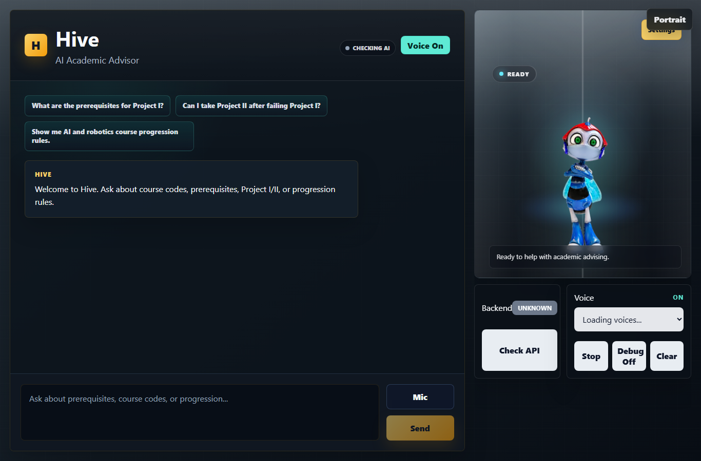

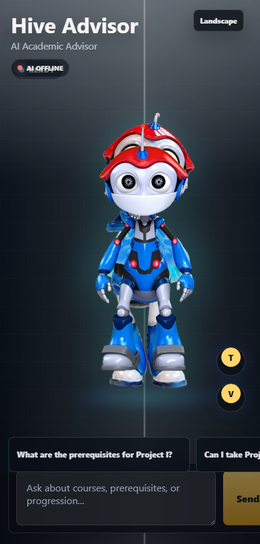

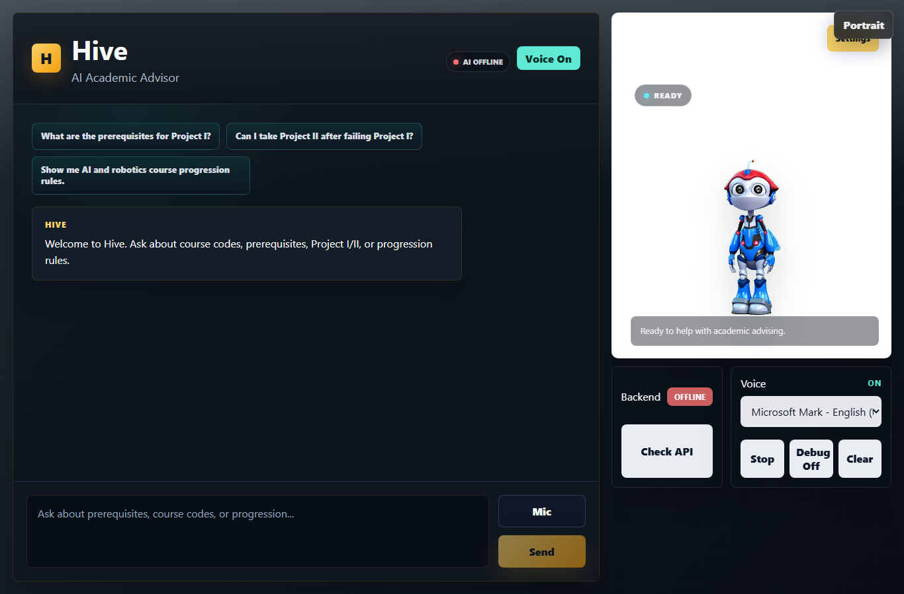

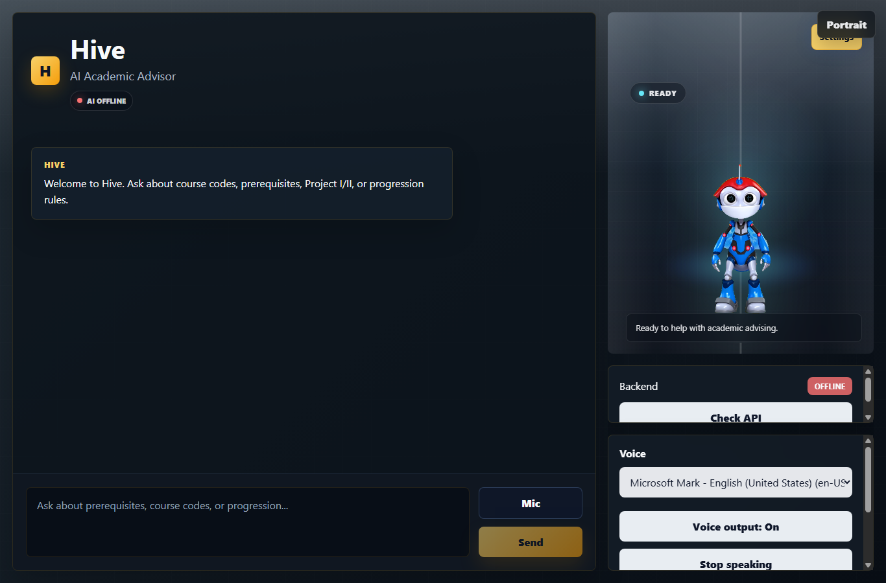

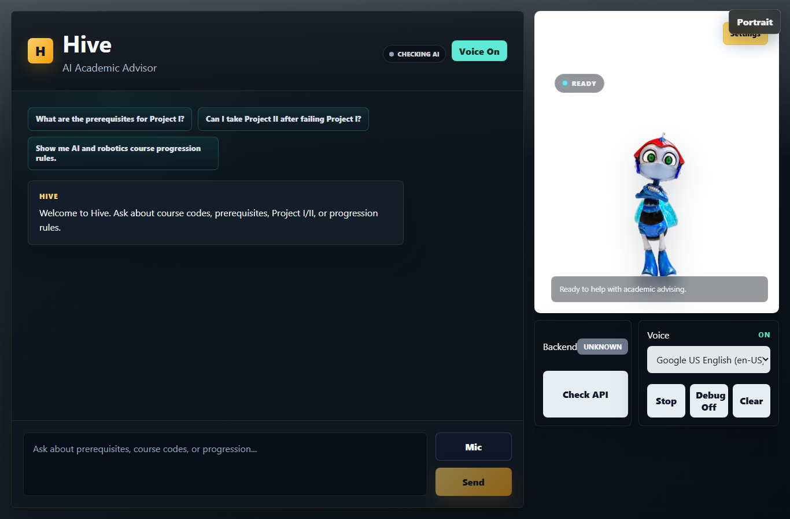

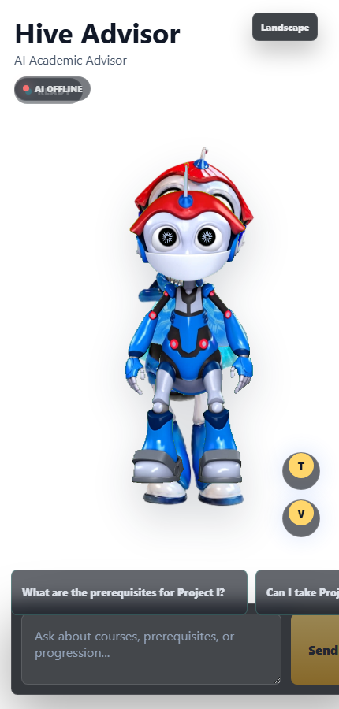


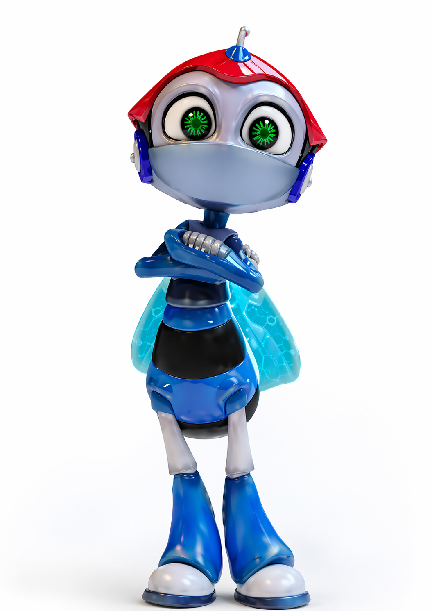

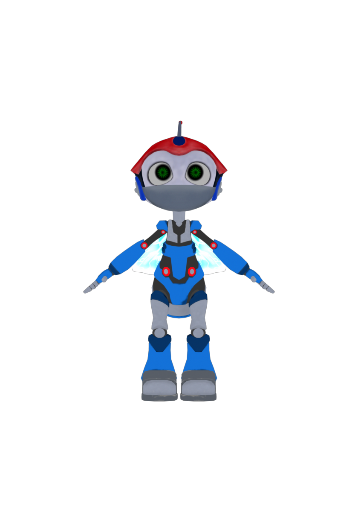

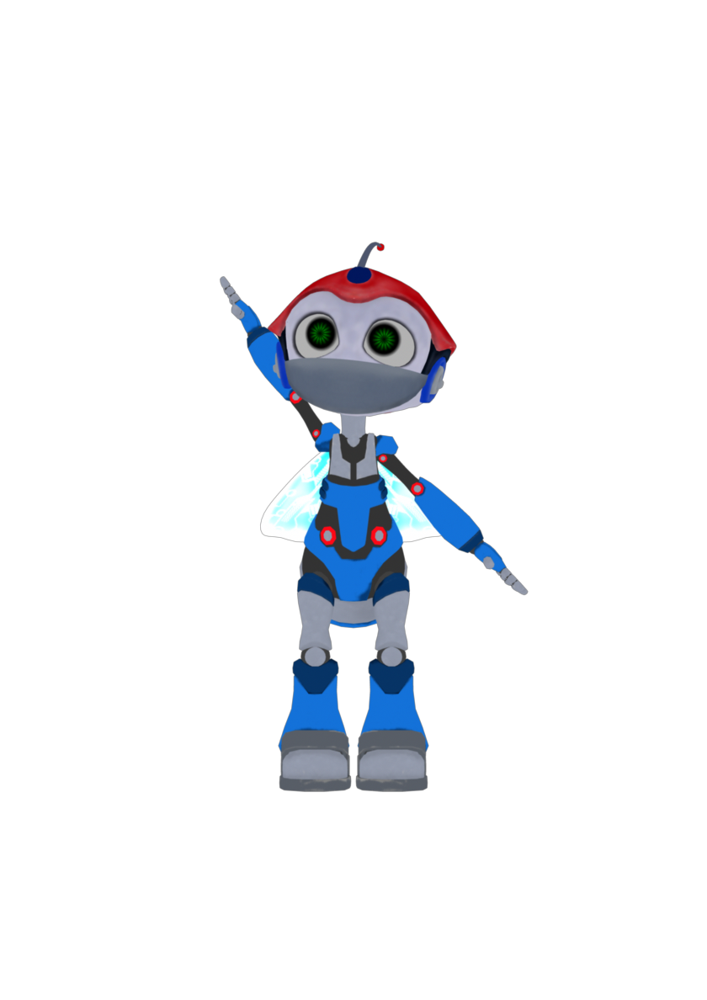

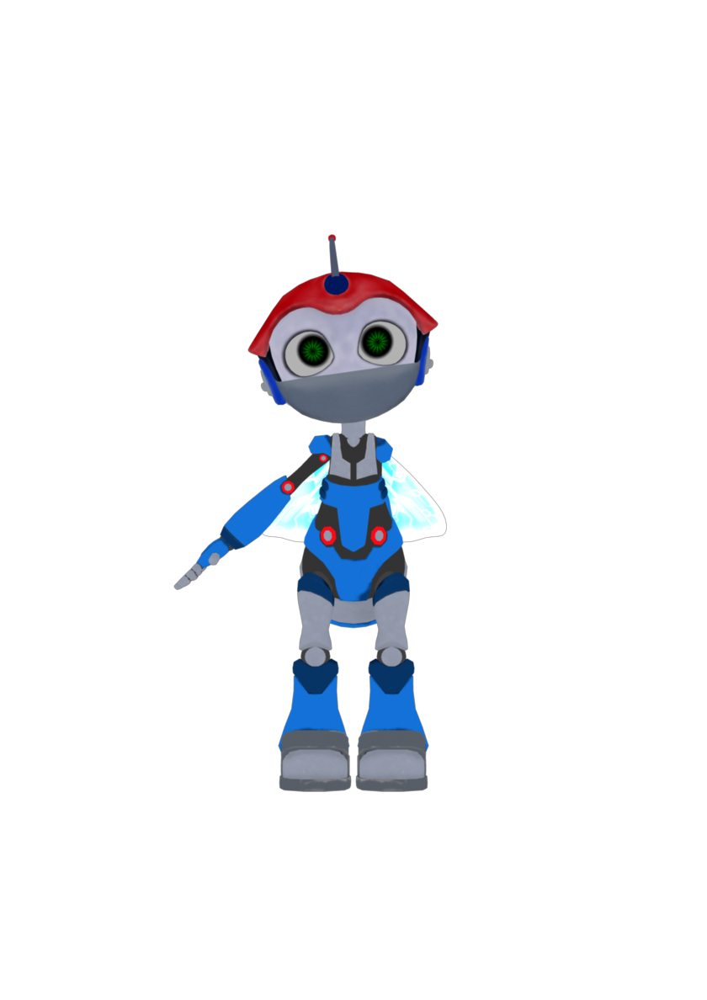

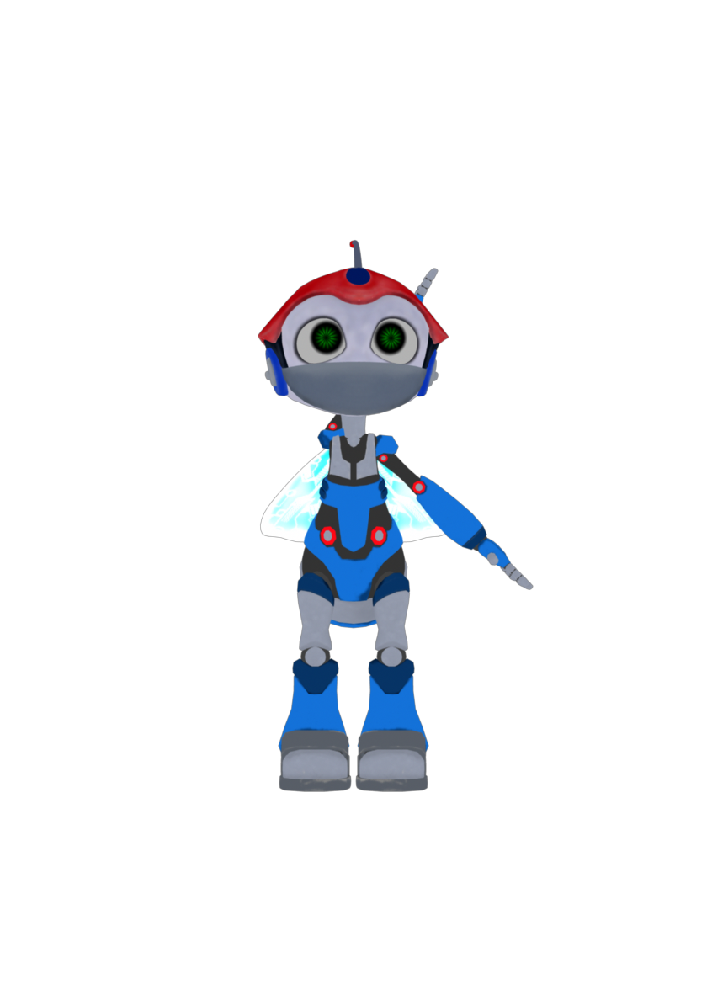

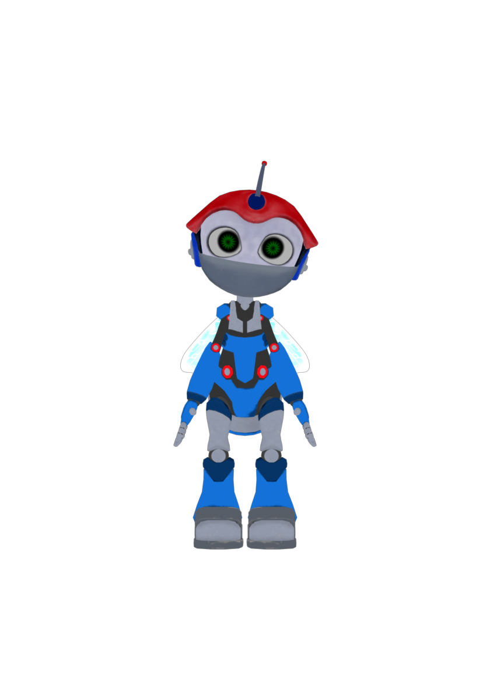

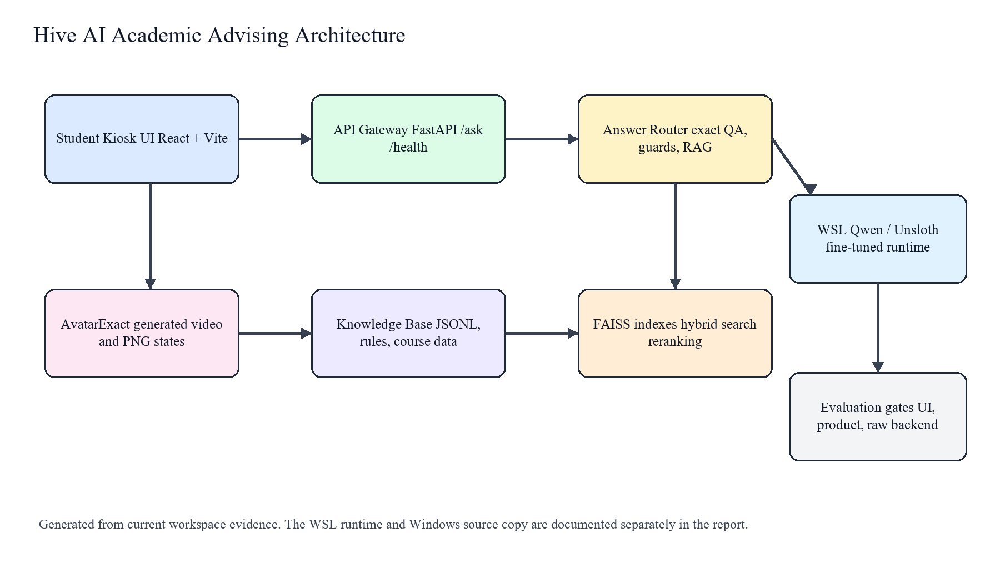

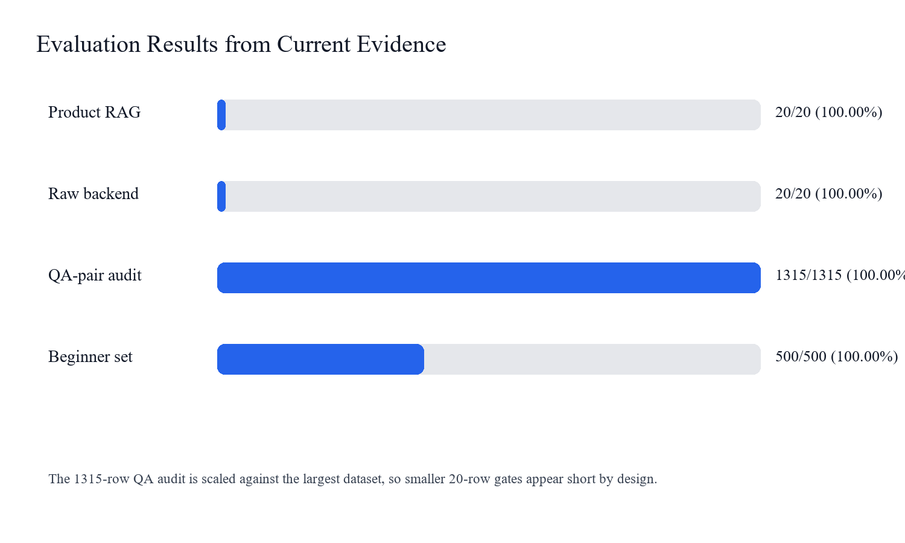

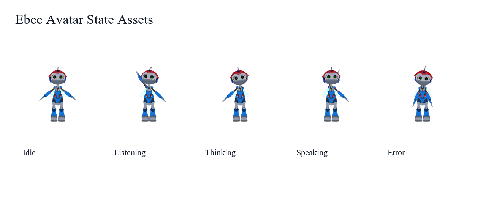

## Required Code Files

- `frontend/src/App.tsx` -> `04_required_code\frontend__src__App.tsx` (1041 lines)
- `frontend/src/components/AvatarExact.tsx` -> `04_required_code\frontend__src__components__AvatarExact.tsx` (410 lines)
- `frontend/src/components/AvatarExact.css` -> `04_required_code\frontend__src__components__AvatarExact.css` (431 lines)
- `frontend/src/courseKnowledge.ts` -> `04_required_code\frontend__src__courseKnowledge.ts` (201 lines)
- `frontend/src/courseKnowledgeData.ts` -> `04_required_code\frontend__src__courseKnowledgeData.ts` (129 lines)
- `frontend/src/main.tsx` -> `04_required_code\frontend__src__main.tsx` (11 lines)
- `frontend/scripts/evaluate-rag-accuracy.mjs` -> `04_required_code\frontend__scripts__evaluate-rag-accuracy.mjs` (308 lines)
- `frontend/scripts/evaluate-all-qa-pairs.mjs` -> `04_required_code\frontend__scripts__evaluate-all-qa-pairs.mjs` (144 lines)
- `frontend/scripts/check-kiosk-readiness.mjs` -> `04_required_code\frontend__scripts__check-kiosk-readiness.mjs` (51 lines)
- `frontend/scripts/check-stop-slop-output.mjs` -> `04_required_code\frontend__scripts__check-stop-slop-output.mjs` (65 lines)
- `frontend/scripts/generate-course-knowledge.mjs` -> `04_required_code\frontend__scripts__generate-course-knowledge.mjs` (159 lines)
- `frontend/package.json` -> `04_required_code\frontend__package.json` (49 lines)
- `frontend/vite.config.ts` -> `04_required_code\frontend__vite.config.ts` (22 lines)
- `hive-backend/app/main.py` -> `04_required_code\hive-backend__app__main.py` (61 lines)
- `hive-backend/app/api/chat.py` -> `04_required_code\hive-backend__app__api__chat.py` (439 lines)
- `hive-backend/app/api/health.py` -> `04_required_code\hive-backend__app__api__health.py` (8 lines)
- `hive-backend/app/rag/course_guard.py` -> `04_required_code\hive-backend__app__rag__course_guard.py` (297 lines)
- `hive-backend/app/rag/hybrid_search.py` -> `04_required_code\hive-backend__app__rag__hybrid_search.py` (190 lines)
- `hive-backend/app/rag/query_router.py` -> `04_required_code\hive-backend__app__rag__query_router.py` (345 lines)
- `hive-backend/app/rag/reranker.py` -> `04_required_code\hive-backend__app__rag__reranker.py` (96 lines)
- `hive-backend/app/rag/indexer.py` -> `04_required_code\hive-backend__app__rag__indexer.py` (267 lines)
- `hive-backend/app/advisor/engine.py` -> `04_required_code\hive-backend__app__advisor__engine.py` (275 lines)
- `hive-backend/app/advisor/alias_resolver.py` -> `04_required_code\hive-backend__app__advisor__alias_resolver.py` (178 lines)
- `hive-backend/app/advisor/programme_detection.py` -> `04_required_code\hive-backend__app__advisor__programme_detection.py` (303 lines)
- `hive-backend/scripts/rebuild_intelligent_robotics_rag.py` -> `04_required_code\hive-backend__scripts__rebuild_intelligent_robotics_rag.py` (1082 lines)
- `hive-backend/rebuild_indices.py` -> `04_required_code\hive-backend__rebuild_indices.py` (54 lines)
- `hive-backend/requirements.txt` -> `04_required_code\hive-backend__requirements.txt` (24 lines)

## Git Context

```json
{
  "git_root": "C:/Users/jeysa",
  "scoped_status": "?? ./",
  "remote": "origin\thttps://github.com/Jetsaw/Kommu_Ai_ChatBot.git (fetch)\norigin\thttps://github.com/Jetsaw/Kommu_Ai_ChatBot.git (push)",
  "log": "9a90c65 (HEAD -> main, origin/main, claude/sweet-mayer) update .gitignore to ignore sessions.db and website_data.json\n541be7e Restructure repo: flatten folder structure\na9f0132 Cleaned repo: removed unused files, added greeting disclaimer, LA escalation, session_state logging"
}
```
